# Security

## Introduction

> You can propose change to this notebook on [github](https://github.com/sf-explorer/app/edit/main/Notebooks/Authorization.md)

This notebook is based on Salesforce Well Architected Framework. In particular, the [Secure](https://architect.salesforce.com/well-architected/trusted/secure#Organizational_Security) section.

For each section we will cover:
 - The best practice as mentionned in the framework
 - Some practice to enforce it, in an interactive way!

```mermaid
mindmap
    root((Secure))
        Organizational Security
            Authentication
              Users based on individuals, not personas
              Password policies
              Multi-factor authentication 
              Single-sign on (SSO)
            📌Authorization📌
              1.Persona Based Access
              2.Principle of least privilege
              3.PermissionSet Model
      Session
        Session Mgt
        Device Access
        Threat Detection
      Data
        Sharing/visibility
        Encryption
```




It will cover in particular the \`Authorization\` section:


## Persona Based Access

### Best Practice
Think about what users can access in terms of personas, not individuals. Thinking of authorization (or security in general) in terms of individual users will not set your system up to scale and evolve. A better approach is to design for and manage personas that represent groups of users. It’s important to recognize that Salesforce solutions architected to be secure use individuals for authentication, but personas for authorization.

Here are the personas covered in the security model and their descriptions I need in my org:

* Human users
    * Internal business users
       * __Sales Director__:
       * __Account Executive__: 
       * __IT Help Desk Team Member__:
    * Internal admin users
       * __HR__
    * External authenticated users
      * None
    * External unauthenticated users
      * __Anonymous access to Explorer Site__
* Non-human users
    * Integration users (1 per interface, 1 connected app)
      * __Imaging__: Insert documents after signature
      * __Payment Gateway__: Update orders when payment has been processed
    * System/technical users


**Enough talking**. Let's see if we are in line.

### In Practice


#### Too many profiles
Too many profiles often leading to a complex and rigid security model 

```soql
SELECT Name, Description, UserType FROM Profile limit 100
```
- [X] I have a description for each of them
- [X] I have less than 20 profiles

#### Avoid few users on profiles
```soql
Select count(Id), Profile.Name FROM User GROUP BY Profile.Name order by count(Id) desc 
```

#### Permission set groups correspond to personas

```soql
Select Name, Label, Type, LastModifiedDate,Description from PermissionSet
 where IsOwnedByProfile = false and NamespacePrefix='' and Type='Group'
 order by LastModifiedDate desc limit 5
```
- [X] The permission set group correspond to my personas


#### Empty a profile
Expand a profile and Click on **Empty this Profile**

```soql execute
SELECT Name, Description, UserType FROM Profile limit 4
```


## Principle of least privilege

### Best Practice
* Apply the Principle of Least Privilege (PoLP): Limit user access strictly to the permissions needed to perform their job duties.
* Profiles managing detailed permissions beyond base-level access, leading to rigid, complex security models, making it difficult to adapt to changing needs and increasing administrative overhead.
* Revoke permissions such as "View All," "Modify All," and other broad access unless absolutely necessary, with appropriate documentation and justification.


### In Practice

#### Too many Admins

```soql 
Select count(Id), Profile.Name FROM User where Profile.Name='System Administrator' GROUP BY Profile.Name order by count(Id) desc 
```

#### "Modify All" permissions
Let's identify the permissions with PermissionsModifyAll where the profile is not \`System Administrator\`

```soql 
SELECT SObjecttype, Parent.Profile.Name, Parent.Type, Parent.Name,
       Parent.Description, Parent.Profile.Description
  FROM ObjectPermissions
  where PermissionsModifyAllRecords=true
  and Parent.Profile.Name !='System Administrator'
```

- [X] **No permission can modify all accounts**

#### Permission Overlap

Run this query and group the result by \`SetupEntity.Name\`
```soql 
SELECT Parent.Name, SetupEntity.Name, SystemModstamp  FROM SetupEntityAccess
 where SetupEntityType='ApexClass' and Parent.Type = 'regular'
```
Features enabled through multiple ways leading to a complex and hard to maintain

## PermissionSet Model

### Best Practice

* Use permission sets and permission set groups to control what metadata users can access and what they can do with that metadata.
* Configure app assignments, feature license activations, and managed package access as well as system permissions, CRUD access,
  and field-level access via permission sets and permission set groups. 
* Include this access in your design design standards and documentation.


### In Practice

#### Profiles used for object base-level permissions. 
Check if your profiles give access to objects or fields through :
```soql
SELECT Field, Parent.Profile.Name, PermissionsRead, PermissionsEdit, SobjectType FROM FieldPermissions
  WHERE Parent.Profile.Name != 'System Administrator' and Parent.IsOwnedByProfile = true limit 100
```

To resolve this you can open each profile and click on "Empty Profile"


#### Profiles used for object base-level permissions. 

```soql
SELECT SobjectType, Field, Parent.Profile.Name, PermissionsEdit 
from FieldPermissions  where Parent.Profile.Name != 'System Administrator' and Parent.IsOwnedByProfile = true limit 100
```

To resolve this you can open each profile and click on "Empty Profile"


## Other Queries

### Last connections
```soql
Select Name, Profile.Name,LastLoginDate, UserRole.Name from User
 where LastLoginDate != null order by LastLoginDate desc limit 5 
```

### User not connected in the last 180 days
```soql
Select Name, Profile.Name,LastLoginDate, UserRole.Name from User
 where LastLoginDate > LAST_N_DAYS:180
```

## Permissions

```sf-explorer query.soql
query: Select Name, Label, Type, LastModifiedDate,Description from PermissionSet  where IsOwnedByProfile = false and NamespacePrefix='' order by LastModifiedDate desc limit 5
tooling: true

```


code to assign a perm set to a user

below code assumes that the user that needs to be assigned with a perm set is know by it id (opUser.Id) ant the permission set to be assigned is known by it name : required permission set name

```apex
PermissionSet ps = [SELECT Id FROM PermissionSet 
    WHERE Name = '<required permission set name>'];
 insert new PermissionSetAssignment(AssigneeId = opUser.id, PermissionSetId = ps.Id);
```

code to find out permission set for a given user

below code assumes the user is named John Doe

```
SELECT Id, PermissionSetId, PermissionSet.Name, PermissionSet.ProfileId, 
    PermissionSet.Profile.Name, AssigneeId, Assignee.Name 
FROM PermissionSetAssignment 
WHERE Assignee.Name = 'John Doe'
```

Code to retrieve all users with a given permission set

below code assumes the permission set is named : Custom PermissionSet Name

```sf-explorer query.soql
SELECT Id, PermissionSetId, PermissionSet.Name, PermissionSet.ProfileId, 
        PermissionSet.Profile.Name, AssigneeId, Assignee.Name 
FROM PermissionSetAssignment WHERE 
PermissionSet.Name = 'Custom PermissionSet Name'
```
