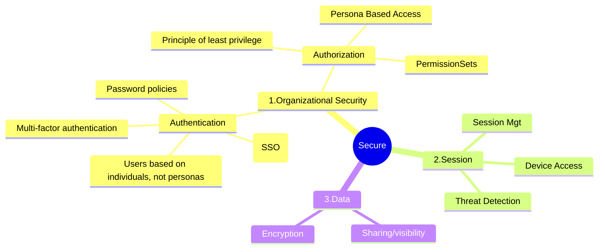

# Security

## Reference documentation

All relevant documentation:
* Salesforce Well Architected - Secure
* <Organization security guidelines and standards>
* <Organization privacy principles>

## Well Architected Framework (Secure)


## Personas overview

List all the personas covered in the security model and their descriptions

* Human users
    * Internal business users
       * Sales Director:
       * Account Executive: 
    * Internal admin users
    * External authenticated users
    * External unauthenticated users
      * None 
* Non-human users
    * Integration users
    * System/technical users

```soql
Select Name, Label, Type, LastModifiedDate,Description from PermissionSet
 where IsOwnedByProfile = false and NamespacePrefix=''
 order by LastModifiedDate desc limit 5
```

## Platform-level security 

This section contains information about the policies you should set for overall organizational security, including passwords, domains and IP ranges, and login hours. Refer to Secure - Organizational Security for more information.


## Authentication methods

Create as many entries as there are authentication methods to access the platform.

```soql:tooling
SELECT DeveloperName from ConnectedApplication 
```

## Single sign-on for internal users

This section contains information about the SSO approach (SAML, OpenId Connect, Other...) and references the Identity Provider solution documentation. 


## Direct access for internal users

This section contains information about the authentication policies you should set within Salesforce to secure manual logins.  Note that these policies should be consistent across your organization and should also match the policies that are in use
 within any third-party Identity Provider / Single Sign-On systems.  Refer to Secure- Authentication for more information.
Note: If Single sign-on for internal users is in place, this should be limited to two emergency accounts that are only used to restore access in case the IdP is unavailable

| Policy                                  | Description                                                                                        | Setting                                                                        |
| --------------------------------------- | -------------------------------------------------------------------------------------------------- | ------------------------------------------------------------------------------ |
| Password Expiration Period              | How often do users need to reset their password?                                                   | 90 Days                                                                        |
| Passwords Remembered                    | How many passwords should the system remember to prevent users from recycling their old passwords? | 3                                                                              |
| Minimum Password Length                 | How long should passwords be?                                                                      | 8                                                                              |
| Password Complexity                     | Combination of alphanumeric, special, uppercase, and lowercase characters                          | Must Include Numbers, Upper Case and Lower Case Letters and Special Characters |
| Maximum Invalid Login Attempts          | How many login attempts before user is locked out?                                                 | 10                                                                             |
| Lockout Period                          | How long will a user be locked out after the maximum number of password attempts is reached?       | 15 Minutes                                                                     |
| Require minimum 1 day password lifetime | Prevent users from changing passwords too frequently                                               | 0                                                                              |
| Password change Policies                | How can users change their password?                                                               | Automated password change flow                                                 |
| Password Reset Policies                 | How can users reset their password?                                                                | Automated password reset flow                                                  |
| MFA Policies                            | Multifactor authentication for direct access                                                       | SMS                                                                            |

```metadata
types:
  - ProfilePasswordPolicy
  - TransactionSecurityPolicy
```


❌ or ✅

| Category | Title | Assessed |
| -- | --- | --- |
| Authentication | Users based on individuals, not personas | ✅ |
| Authentication | Password policies | ✅ |

### Users based on individuals, not personas

 Profiles used for base-level permissions.
Check if your profiles give access to object, fields through : 

Identify profiles that are not following the best practice
```soql
SELECT Field, PermissionsRead, PermissionsEdit FROM FieldPermissions
  WHERE Parent.Profile.Name = 'Profile Name'
```

### User with PermissionsModifyAll

```soql
SELECT SObjectType, PermissionsRead, PermissionsCreate, PermissionsEdit, PermissionsDelete, PermissionsViewAll,
 PermissionsModifyAll,Parent.Profile.Name FROM ObjectPermissions WHERE PermissionsModifyAll=true 
```


## Users

Last connections
```soql
Select Name, Profile.Name,LastLoginDate, UserRole.Name from User
 where LastLoginDate != null order by LastLoginDate desc limit 5 
```

User not connected in the last 180 days
```soql
Select Name, Profile.Name,LastLoginDate, UserRole.Name from User
 where LastLoginDate != null order by LastLoginDate desc limit 5 
```

