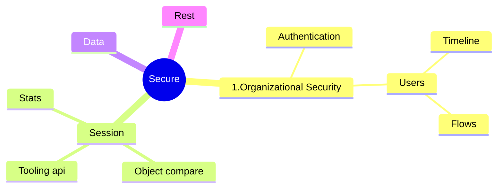

# Security



 Profiles used for base-level permissions.
Check if your profiles give access to object, fields through : 

- [X] Are you ready?

| ddd | dd |
| dd | xx |

```soql
SELECT SObjectType, PermissionsRead, PermissionsCreate, PermissionsEdit, PermissionsDelete, PermissionsViewAll, PermissionsModifyAll FROM ObjectPermissions WHERE Parent.Profile.Name = 'Profile Name'
```

SELECT Field, PermissionsRead, PermissionsEdit FROM FieldPermissions WHERE Parent.Profile.Name = 'Profile Name'
Identify profiles that are not following the best practice

Empty profile tool

SF Explorer (Demo)


## 1. Permissions

```sf-explorer query.soql
query: Select Name, Label, Type, LastModifiedDate,Description from PermissionSet  where IsOwnedByProfile = false and NamespacePrefix='' order by LastModifiedDate desc limit 5
tooling: true

```

## Users

```sf-explorer query.soql
query: Select Name, Profile.Name,LastLoginDate, UserRole.Name from User where LastLoginDate != null order by LastLoginDate desc limit 5 

```
