# Security

## Reference documentation

All relevant documentation:
* Salesforce Well Architected - Secure (https://architect.salesforce.com/well-architected/trusted/secure)
* **Organization security guidelines and standards**
* <Organization privacy principles>

## Well Architected Framework (Secure)

```mermaid
mindmap
    root((Secure))
        1.Organizational Security
            Authentication
              Users based on individuals, not personas
              Password policies
              Multi-factor authentication 
              Single-sign on (SSO)
            📌Authorization
              Principle of least privilege
              Persona Based Access
              PermissionSets
      2.Session
        Session Mgt
        Device Access
        Threat Detection
      3.Data
        Sharing/visibility
        Encryption
```

