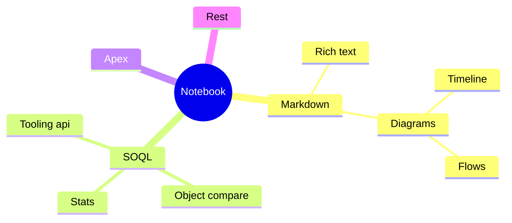
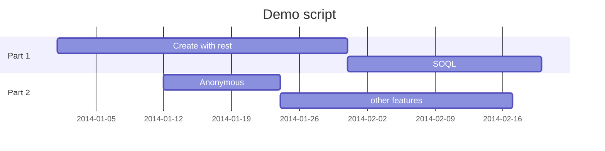

# Notebook features

## Introduction

SF Explorer Notebooks offer a versatile and interactive computing environment designed for Salesforce. Here are some of the key benefits:

1. **Interactivity**: SF Explorer Notebooks allow for an interactive coding experience. Dedicated components can be used to interact with your Salesforce org like the examples given below.

2. **Visualization**: Integrated support for data visualization powered by [Mermaid](https://mermaid.js.org/) and rich components behind SF Explorer toolkit.

3. **Documentation**: Markdown support enables users to add rich text, and hyperlinks directly within the notebook. This makes it easier to document code, explain methodologies, and share insights.

4. **Reproducibility**: Notebooks can be shared easily, preserving code, outputs, and documentation in a single file. This ensures that others can reproduce the results by running the notebook on their own machines.

5. **Educational Use**: The interactive nature of SF Explorer Notebooks makes them an excellent tool for on boarding individuals, and other technical subjects. Instructors can provide students with interactive assignments and tutorials.

6. **Sharing**: Notebooks can be shared and promoted in your pipelines with support of a dedicated Custom Metadata. See at the end of this notebook for more detail.

In summary, SF Explorer Notebooks offer a powerful and flexible environment for documentation, data analysis, visualization, and coding. 

By the way, this is a notebook. Try editing it to see for yourself!





## Markdown support
> A block quote with ~strikethrough~ and a [URL](https://reactjs.org).

* Lists
* [ ] todo
* [x] done

A table:

| Name | Age |
| - | - |
| Nicolas | 42 |

## Call a salesforce API

You can call any Salesforce API and use the excellent [fakerJS](https://fakerjs.dev/api/person.html) library to generate your data.
Here is an example on how to create a contact. You can call any salesforce api with the method and headers you want.

```sf-explorer query.rest
method: POST
url: /services/data/v62.0/sobjects/Contact
label: Call API
headers: 
  operation: creation
===
{
  "LastName": "Explorer",
  "FirstName": "faker.person.firstName()"
}
```

## Search for a record

You can use SOQL to find records. For example to find the last **5 modified contacts**. Click on the refresh button to see the contact you just created.

```sf-explorer query.soql
query: select FirstName, LastName, LastModifiedDate from Contact order by LastModifiedDate desc limit 5
tooling: false
```

## Execute Anonymous Apex
Anonymous Apex is a way to execute Apex code on the fly in Salesforce without having to save it to a file. 
It is often used for quick testing or debugging. Here is an example of an anonymous Apex call that creates a new Contact record:


```apex 
// Create a new Contact record
Contact newContact = new Contact();
newContact.LastName = 'Sample Contact';
newContact.FirstName = 'Explorer';

// Insert the new Contact record into the database
insert newContact;

// Output some debug information
System.debug('New Contact created with Id: ' + newContact.Id);
```

You can also execute anonymous apex. Try hovering keywords like **Contact**, **System** or **insert** to see associated documentation.
Code completion is of also available.


## Display objects APIs

Other APIs can of course be called, here is an example of supported API for the `Contact` object.

```sf-explorer sobject.open-api
objects:
   - Contact
```

## Display objects ERD

```sf-explorer sobject.erd
objects:
   - Account
   - Contact
   - Opportunity
```


## Search for a flow

Search for metadata components like flows, try opening a flow to see how it is structured. You can also delete a flow version from here.

```sf-explorer query.soql
query: Select MasterLabel, LastModifiedBy.Name, LastModifiedDate from Flow order by LastModifiedDate desc limit 5
tooling: true
```


## Save an share
Use a custom metadata to save and share your notebooks with your team.
